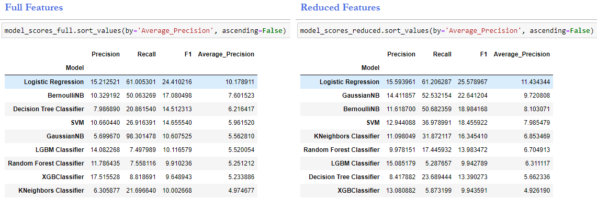
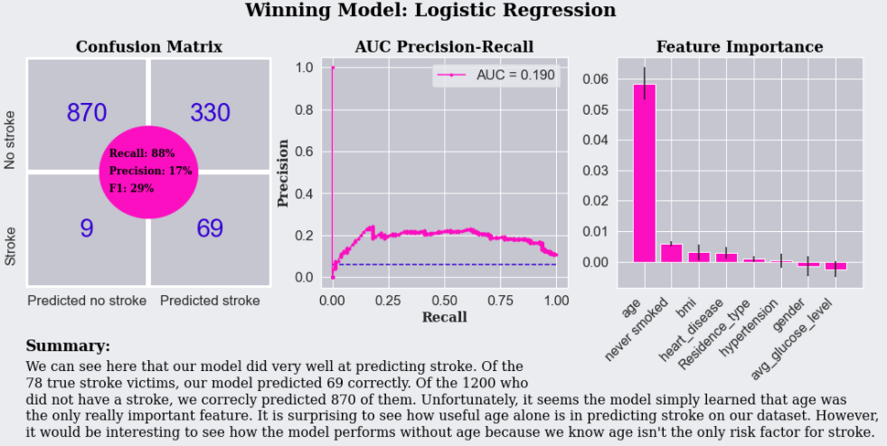

# stroke_prediction_capstone
Using various attributes to predict the probability of stroke

*Stroke is the No.5 cause of death in the United States, and a leading cause of disability. A stroke occurs when a blood vessel is either blocked by a clot or bursts, depriving the brain of oxygen and nutrients. When that happens, the cells die in the part of the brain that isn't receiving blood. In the era of big data, doctors and researchers are constantly trying to find ways to predict those who are at risk of disease, and that is what we are trying to do here. We are trying to take some health and sociodemographic indicators and use machine learning to build a model that can predict who is at risk for stroke.  *

## 1. Data

This dataset comes from the Kaggle website. To view the original Kaggle data or to import it using the Kaggle API click on the link below:

> * [Kaggle Dataset](https://www.kaggle.com/fedesoriano/stroke-prediction-dataset)

## 2. Data Cleaning 

Our data consists of 11 attributes: gender; age; hypertension (binary); heart_disease (binary); ever_married (binary); work_type (private, self-employed, govt_job, child, never_worked); Residence type (binary of urban and rural), avg_glucose_level, bmi, smoking_status(unknown, never_smoked, former_smoker, current_smoker), and the target variable of stroke (binary). 

* **Problem 1:** Missing values in the BMI feature. **Solution:** I imputed the data based on the median BMI based on age from a 2015-2016 survery conducted by the CDC. This seemed to be a better estimate than using the median of our own data because it comes from a larger sample size and we can presume efforts were made to make this more representative of the general population. 

[Median BMI by age in USA](https://dqydj.com/bmi-distribution-by-age-calculator-for-the-united-states/)

* **Problem 2:** Categorical features need to be converted to numeric data  **Solution:** I used one hot encoding to convert our categorical features to numberic. 

* **Problem 3:** A quick look at a correlation heatmaps reveals we have many features that are highly correlated. This can lead to the multicollinearity conundrum, as our regression model's regression coefficients related to the highly correlated variables will be unreliable.  **Solution:** Wherever there were pairs of highly correlated data, I removed one of them. 

* **Problem 4:** Imbalanced dataset with the target variable. **Solution:** We used SMOTE oversampling technique to correct for this.

* **Problem 5:** Non-standardized data. **Solution:** We standardized our data using StandardScaler()

## 3. EDA

* The continuous data features appear to have a roughly normal distribution. A quick look reveals the highest correlation seems to be with age, followed by presence of hypertension, avg_glucose_levels, heart_disease and ever_married. 

## 4. Algorithms & Machine Learning

I chose to work with the Python scikit-learn's supervised machine learning methods for classification. These included: XGBoost; BernoullliNB; GausianNB; LogisticRegression; DecisionTree; RandomForest; SVC; KNN; LGBMClassifier. The highest accuracy went to Random Forest, but focusing on accuracy didn't turn out to be the best approach, as the imbalanced test set rewarded classifying almost everything as non-stroke risk. Thus, I decided to focus on recall, as a real world situation might prefer us to favor having a high number of true positives even if it is a trade-off that leads to more false positives. We were looking for a good trade-off though, as merely classifying everything as stroke is also unhelpful in a real world application. 

**WINNER: Logistic Regression Agorithm**

This algorithm clearly did the best at predicting stroke. However, when we look at the feature importance we can see that the algorithm basically learned to lean almost exclusively on age. Nonetheless, given the limited features we were given, this is the algorithm that performed the best. 

## 5. Predicting Ability

We can see that our Logistic Regression Model actually was able to predict 84% of true stroke victims as stroke and 69% of non-stroke patients as having no stroke in our hold out test dataset. 

## 6. Future Improvements

* Predicting who will have a stroke and who will not is never going to be a perfect science with a 100% prediction rate, but we did learn that age is a very important feature in doing so. However, we can learn from our other models feature importance that the other health indicators like avg_glucose_levels, heart_disease and hypertension. We also learned the sociodemographic features were not that influential in our models. So from here, we can take the best features and perhaps build no models with with different datasets that contain the most influential features from our findings and other features that may prove useful. 

